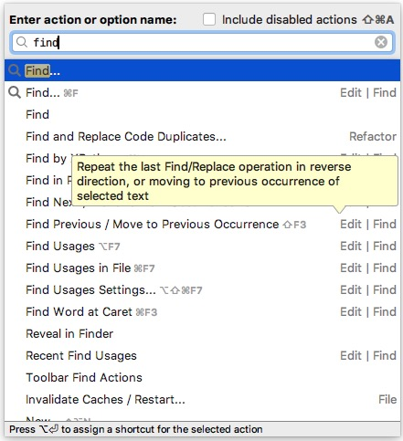
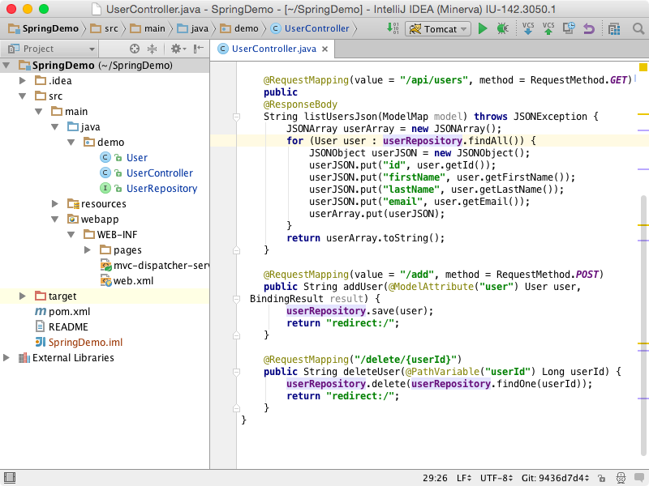
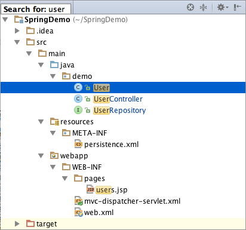
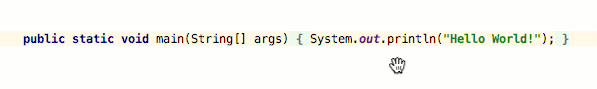
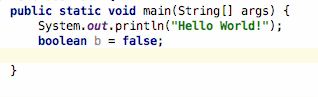
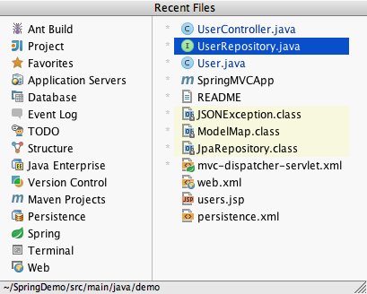
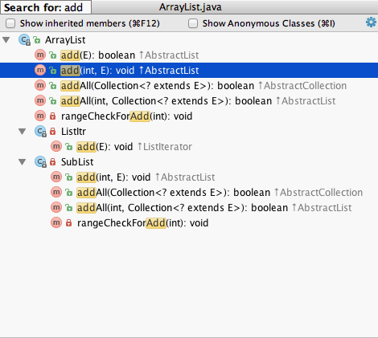
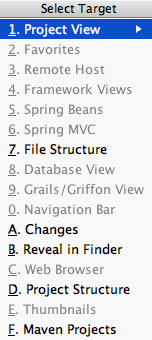
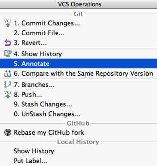

# IntelliJ IDEA「初體驗」

## 体验IntelliJ IDEA {#tan-suo-intellij-idea}

本指南旨在帮助您通过IntelliJ IDEA提高工作效率，并提供最重要功能的概述，以及提示，技巧和最热门的快捷方式。

### 用户界面 {#yong-hu-jie-mian}


如果您不知道某个操作的快捷键，请尝试使用查找操作功能 **⇧⌘A \(Ctrl+Shift+A\)**。输入名称查看其快捷键或直接调用。



IntelliJ IDEA 代码编辑器有许多特别之处，最值得注意的是，您可以在不离开它的情况下调用几乎所有的IDE特性，这使得您可以组织布局，隐藏诸如工具栏和窗口等辅助控件，使其拥有更多的屏幕空间。

通过快捷键访问工具窗口\(**Tool Windows**\)会将输入焦点移动到它，因此您可以在其上下文中使用所有键盘命令。当您需要返回代码编辑器时，请按 **⎋\(Esc\)**。

以下是最常用的工具窗口快捷键列表：

| 工具窗口 \(Tool Windows\) | 快捷键 \(Mac \| Win/Linux\) |
| --- | --- | --- | --- | --- | --- | --- |
| 项目 \(Project\) | ⌘1 \(Alt+1\) |
| 版本控制 \(Vernsio Control\) | ⌘9 \(Alt+9\) |
| 运行 \(Run\) | ⌘4 \(Alt+4\) |
| 调试 \(Debug\) | ⌘5 \(Alt+5\) |
| 终端 \(Terminal\) | ⌥F12 \(Alt+F12\) |
| 代码编辑器 \(Editor\) | ⎋ \(Esc\) |

如果您想专注于代码，请尝试免打扰模式 \(**Distraction Free Mode**\)。它将移除所有工具栏，工具窗口和编辑器选项卡。要切换到此模式，请在主菜单上选择 **View** \| **Enter Distraction Free Mode**。

还有一种替代方案按下 **⇧⌘F12 \(Ctrl+Shift+F12\)** 隐藏所有工具窗口 。您可以再次按此快捷键将布局恢复为默认值。

IntelliJ IDEA中的大多数组件（工具窗口和弹出窗口）都提供快速搜索功能。此功能允许您过滤列表，或使用搜索查询导航到特定项目。

### 编辑器基础知识 {#bian-ji-qi-ji-chu-zhi-shi}

由于在IntelliJ IDEA中，您可以从本地历史 \( **Local History**\) 中撤消重构并恢复更改，因此每次要求您保存更改并没有意义。

编辑器最有用的快捷键：

| 动作 | 快捷键 \(Mac \| Win/Linux\) |
| --- | --- | --- | --- | --- | --- | --- | --- | --- | --- | --- | --- | --- | --- | --- |
| 移动当前的代码块 | ⇧⌘↑ ⇧⌘↓ \(Ctrl+Shift+Up Ctrl+Shift+Down\) |
| 复制一行代码 | ⌘D \(Ctrl+D\) |
| 删除一行代码 | ⌘Y \(Ctrl+Y\) |
| 行注释 | ⌘/ \(Ctrl+/\) |
| 块注释 | ⌃⇧/ \(Ctrl+Shift+/\) |
| 在当前打开的文件中查找 | ⌘F \(Ctrl+F\) |
| 在当前文件中查找并替换 | ⌘R \(Ctrl+R\) |
| 查找下一个 | F3 |
| 查找上一个 | ⇧F3 \(Shift+F3\) |
| 在打开的标签之间导航 | ⌃→ ⌃← \(Alt+Right Alt+Left\) |
| 编辑焦点后退/前进 | ⌥⌘← ⌥⌘→ \(Ctrl+Alt+Left Ctrl+Alt+Right\) |
| 展开或折叠编辑器中的代码块 | ⌘+ ⌘- \(Ctrl+NumPad + Ctrl+NumPad -\) |
| 代码生成 | ⌃N \(Alt+Insert\) |
| 代码环绕 | ⌥⌘T \(Ctrl+Alt+T\) |

要使用基于语法的扩展选择\(**Extend Selection**\)，请按**⌘W \(Ctrl+W\)**。要缩小选择，请按 **⇧⌘W \(Ctrl+Shift+W\)**。

IntelliJ IDEA一次可以选择多个相同代码段。选中代码并按下 **⌃G \(Alt+J\)** 或 **⌃⇧G \(Shift+Alt+J\)** 您可以选择/取消选择任何一段或多段代码。

### 代码补全 {#dai-ma-wan-cheng}


要覆盖插入代码提示处的代码片段，而不是直接插入请按 **⇥ \(Tab\)**。如果您正在编辑代码的一部分（例如文件名），这将非常有用。


通过快捷键**⌃Space \(Ctrl+Space\)** 进行简单补全\(**Basic Completion**\)时，可以获得有关变量，类型，方法，表达式等的基本建议。当您调用其两次时，它会显示更多结果，包括私有成员和非导入的静态成员。

智能补全\(**Smart Completion**\)能提供预期的类型和数据建议，并提供相关的上下文选项。要调用智能补全，请按 **⌃⇧Space \(Ctrl+Shift+Space\)**。当您调用其两次时，它会显示更多结果。

要让IntelliJ IDEA为您完成声明，请按**⇧⌘⏎ \(Ctrl+Shift+Enter\)**。 语句补全\(**Statement Completion\)** 将自动添加缺少的括号，大括号和必要的格式。

如果您想查看任何方法或构造函数的参数建议，请按 **⌘P \(Ctrl+P\)**。IntelliJ IDEA为每个重载的方法或构造函数显示参数信息，并突出显示已经键入的参数的最佳匹配。

使用后缀补全\(**Postfix Completion**\)功能，可以根据您在 `.` 后键入的后缀将已经输入的表达式转换为另一种表达式。

### 导航 {#dao-hang}

#### 最近使用的文件 {#zui-jin-de-wen-jian}

大多数情况下，您使用一组有限的文件集，并需要快速切换它们。这时最快的方式就是通过**⌘E \(Ctrl+E\)** 打开最近文件\(**Recent Files\)**功能。默认情况下，焦点位于上次访问的文件上。请注意，您还可以通过此界面打开任何工具窗口\(**Tool Windows**\)：

导航到类\(**Navigate to Class**\)，按下**⌘N \(Ctrl+N\)** 可以使用复杂的表达式，包括驼峰，路径，行号，中间名称匹配等等。如果您按下它两次，它会向您显示项目外\(**Jar**\)中的结果。

导航到文件\(**Navigate to File**\)与类导航类似，快捷键为**⇧⌘N \(Ctrl+Shift+N\)**，但仅用于文件和文件夹。要导航到文件夹，请使用**斜杠**结束表达式 。

导航到符号\(**Navigate to Symbol**\)， **⌥⇧⌘N \(Ctrl+Shift+Alt+N\)** 允许您按名称查找方法或字段，甚至Spring MVC Mapping路径等等。

#### 文件结构 {#jie-gou-ti}

当你不需要在多个文件之间切换时，你很可能需要文件内导航。最简单的方法就是按**⌘F12 \(Ctrl+F12\)**弹出文件结构窗口，您可以快速导航到其中任何一个位置：

#### 文件选择 {#xuan-ze}

如果您需要在特定工具窗口（或Finder / Explorer）中显示选中的文件（比如在资源管理器中、所有文件变更中），可以通过 **⌥F1 \(Alt+F1\)** 选择\(**Select In**\) 操作来实现：

导航快捷键包括：

| 动作 | 快捷键 \(Mac \| Win/Linux\) |
| --- | --- | --- | --- | --- | --- | --- | --- | --- | --- | --- |
| 搜索任何地方 | Double Shift |
| 导航到类 | ⌘N \(Ctrl+N\) |
| 导航到文件 | ⇧⌘N \(Ctrl+Shift+N\) |
| 导航到符号 | ⌥⇧⌘N \(Ctrl+Shift+Alt+N\) |
| 最近的文件 | ⌘E \(Ctrl+E\) |
| 文件结构 | ⌘F12 \(Ctrl+F12\) |
| 文件选择 | ⌥F1 \(Alt+F1\) |
| 导航到声明 | ⌘B \(Ctrl+B\) |
| 导航到类型层次结构 | ⌃H \(Ctrl+H\) |
| 显示UML弹出窗口 | ⌥⌘U \(Ctrl+Alt+U\) |

### 快速弹窗 {#kuai-su-dan-chu-chuang-kou}


快速弹窗 可用于编辑器中的代码; 但是它们也可以通过快捷键用于任何其他列表中的项目。


快速弹窗 有助于查看代码相关的其他信息。以下是您希望提高效率时应该知道的快速弹窗列表：

| 动作 | 快捷键 \(Mac \| Win/Linux\) |
| --- | --- | --- | --- | --- |
| 文档信息 | ⌃J \(Ctrl+Q\) |
| 快速预览定义处 | ⇧⌘I \(Ctrl+Shift+I\) |
| 显示所有引用 | ⌥⌘F7 \(Ctrl+Alt+F7\) |
| 显示实现类 | ⌥⌘B \(Ctrl+Alt+B\) |

### 重构基础知识 {#zhong-gou-ji-chu-zhi-shi}

IntelliJ IDEA提供了一套全面的自动代码重构功能，可在正确使用时显著提高工作效率。首先，在应用重构之前，请不要选择任何东西。IntelliJ IDEA足够聪明，可以确定您要重构的语句，并且只有在有多种选择可能的情况下才会要求确认。


要撤消上次重构，请将焦点切换到“ 项目 \(**Project**\) ”窗口，然后按⌘Z \(Ctrl+Z\)。


| 动作 | 快捷键 \(Mac \| Win/Linux\) |
| --- | --- | --- | --- | --- | --- | --- | --- | --- | --- | --- |
| 重命名 | ⇧F6 \(Shift+F6\) |
| 提取为变量 | ⌥⌘V \(Ctrl+Alt+V\) |
| 提取为字段 | ⌥⌘F \(Ctrl+Alt+F\) |
| 提取为常量 | ⌥⌘C \(Ctrl+Alt+C\) |
| 提取为方法 | ⌥⌘M \(Ctrl+Alt+M\) |
| 提取为参数 | ⌥⌘P \(Ctrl+Alt+P\) |
| 内联 | ⌥⌘N \(Ctrl+Alt+N\) |
| 复制 | F5 |
| 移动 | F6 |
| 重构为... | ⌥⇧⌘T \(Ctrl+Shift+Alt+T\) |


真正节省时间是在重构的帮助下提取字符串的能力 。只需选择一个字符串片段并应用重构，用引入的常量或变量精确替换所有选定的片段。


有关更多详细信息，请参阅 [重构源代码](https://shaofan.gitbook.io/help/idea/refactoring-source-code.html)。

### 引用查找 {#xun-zhao-yong-fa}

**Find Usages** 可帮助您快速查找引用光标上符号的所有代码片段，无论符号是类，方法，字段，参数还是其他语句。只需按下 **⌥F7 \(Alt+F7\)** 获取按引用类型，模块和文件分组的参考列表。

如果您要查找的是纯文本，请使用按 路径查找⌃⇧F。

有关更多详细信息，请参阅[查找用法](https://shaofan.gitbook.io/help/idea/finding-usages.html)。

### 代码检查 {#jian-cha}


编辑器允许您通过键盘快捷键快速浏览突出显示的问题。按此 F2 键转到下一个问题，然后 Shift+F2 转到上一个问题。


代码检查\(**Inspections**\) 是内置的静态代码分析工具，可帮助您查找可能的错误， 无用代码，检测性能问题以及改进整体代码结构。

大多数检查不仅可以告诉你问题出在哪里，还可以立即提供快速解决方案。按 **⌥⏎ \(Alt+Enter\)**选择一个快速修复。

如果要使用复杂而无法即使运行的检查对整个项目执行代码分析时。您可以通过以下两种方式之一完成此操作：从主菜单中选择 **Analyze \| Inspect Code**，或选择 **Analyze \| Run Inspection by Name** 以按名称运行检查。

请注意，虽然代码检查可为可能存在问题的代码提供快速修复，但有时对代码进行自动更改不一定是正确的或满足你的意图目的。要获取适用于代码的意向列表，请按**⌥⏎ \(Alt+Enter\)**。

有关更多详细信息，请参阅[代码检查](https://shaofan.gitbook.io/help/idea/code-inspection.html)。

### 代码样式和格式 {#dai-ma-yang-shi-he-ge-shi}

IntelliJ IDEA会在 您编辑时自动应用您在“ [代码样式”设置中](https://shaofan.gitbook.io/help/idea/settings-code-style.html)配置的 [代码样式](https://shaofan.gitbook.io/help/idea/settings-code-style.html)，并且在大多数情况下，您无需 显式调用“ 重新格式代码”操作。

有用的格式化快捷键：

| 动作 | 快捷键 |
| --- | --- | --- | --- |
| 格式化代码 | ⌥⌘L \(Ctrl+Alt+L\) |
| 自动缩进行 | ⌥⌘I \(Ctrl+Alt+I\) |
| 优化Import | ⌥⌘O \(Ctrl+Alt+O\) |

请注意，默认情况下，IntelliJ IDEA使用常规空格来缩进而不是制表符\(Tabs\)。如果您有包含大量缩进的文件，则可能需要通过在Java代码样式设置中启用 **Use tab characte**r 选项来优化其大小。

有关更多详细信息，请参阅重新 格式化源代码。

### 版本控制基础 {#ban-ben-kong-zhi-ji-chu}

要从版本控制系统（VCS）签出项目，请在欢迎屏幕上或主菜单**VCS**中单击 **Checkout from Version Control**。

要在当前文件，目录或整个项目上快速执行VCS操作，请按下VCS操作弹窗 **⌃V \(Alt+\`\)**

配置完VCS设置后，您将看到**Version Control** 工具窗口。您可以在任何时候通过按**⌘9 \(Alt+9\)**切换到它。

**Version Control** 工具窗口中的 **Local Changes** 选项卡显示了您所有的本地更改：包括 staged和 unstaged。

有用的VCS快捷键：

| 动作 | 快捷键 |
| --- | --- | --- | --- | --- | --- |
| 版本控制工具窗口 | ⌘9 \(Alt+9\) |
| VCS 操作弹框 | ⌃V \(Alt+\`\) |
| 提交更改 | ⌘K \(Ctrl+K\) |
| 更新项目 | ⌘T \(Ctrl+T\) |
| 推送提交 | ⇧⌘K \(Ctrl+Shift+K\) |

有关更多详细信息，请参阅[使用IntelliJ IDEA的版本控制](https://shaofan.gitbook.io/help/idea/version-control-integration.html)。

#### 分支 {#fen-hang}

要在分支上执行操作，请从 VCS 主菜单或上下文菜单，VCS操作弹出窗口或状态栏右侧的窗口小部件中选择分支。

请注意，对于多个仓库，IntelliJ IDEA会同时在所有分支上执行所有VCS操作，因此您无需手动切换它们。

当您需要存储一些本地更改而不将它们提交到仓库时，Shelves，stashes 和补丁可以帮助您。然后，您可以切换到文件的仓库版本，然后稍后再回到您的更改。

有关更多详细信息，请参阅[管理分支](https://shaofan.gitbook.io/help/idea/manage-branches.html)。

#### 编译 {#fen-hang}

默认情况下，IntelliJ IDEA不会在保存时自动编译项目。要编译项目，请从主菜单选择 **Build \| Build Project**，或按⌘F9 \(Ctrl+F9\)。

有关更多详细信息，请参阅[编译应用程序](https://shaofan.gitbook.io/help/idea/compiling-applications.html)。

### 运行和调试 {#yun-hang-he-tiao-shi}


通过按住Alt时鼠标点击断点可以快速禁用任何断点。要更改断点详细信息（例如条件），请按⇧⌘F8 \(Ctrl+Shift+F8\)


一旦您通过从主菜单选择 **Run \| Edit Configurations** 创建 运行/调试配置，您即可开始运行和调试您的代码。

| 动作 | 快捷键 |
| --- | --- | --- |
| 运行 \(Run\) | ⇧F10 \(Shift+F10\) |
| 调试 \(Debug\) | ⇧F9 \(Shift+F9\) |

在调试模式下，您可以按**⌥F8 \(Alt+F8\)**使用 表达式计算工具 \(**Evaluate expression tool**\) 计算任何表达式。该工具以与编辑器相同的方式提供代码补全，因此您将很容易输入任何表达式。

有时，您可能想要进入特定方法，但不是第一个将被调用的方法。在这种情况下，通过按下**⇧F7 \(Shift+F7\)**使用智能单步进入\(**Smart step into**\)选择特定方法。

| 动作 | 快捷键 |
| --- | --- | --- | --- | --- | --- | --- | --- |
| Toggle breakpoint | ⌘F8 |
| Step into | F7 |
| Smart step into | ⇧F7 |
| Step over | F8 |
| Step out | ⇧F8 |
| Resume | F9 |
| Evaluate expression | ⌥F8 |

如果你想在调试时“倒带”，你可以通过**Drop Frame**操作来完成。如果你错误地走得太远，这特别有用。这将不会恢复应用程序的全局状态，但至少会让您恢复到之前的堆栈帧。

有关更多详细信息，请参阅运行和调试。

#### 重新加载更改和热部署 {#zhong-xin-jia-zai-geng-gai-he-re-cha-ba}

有时，您需要在不关闭进程的情况下在代码中插入微小更改。由于Java虚拟机具有HotSwap功能，因此在调用 **Build** 时，IntelliJ IDEA会自动处理这些情况 。

### 使用构建工具（Maven / Gradle） {#shi-yong-gou-jian-gong-ju-maven-gradle}

一旦你导入/创建了你的Maven / Gradle项目，你可以直接在编辑器中编辑它 `pom.xml` 或`build.gradle`文件。对底层构建配置的任何更改最终都需要与IntelliJ IDEA中的项目模块同步。

如果您希望IDE立即同步更改，请执行以下操作：

* 对于 `pom.xml` 启动 **Import Maven projects automatically** 选项路径为：**File \| Settings \| Build, Execution, Deployment \| Build Tools \| Maven \| Importing** \(Windows and Linux\) ， **IntelliJ IDEA \| Preferences \| Build, Execution, Deployment \| Build Tools \| Maven \| Importing** \(macOS\)。
* 对于`build.gradle`，启用 **Use auto-import** 选项路径为：**Settings/Preferences \|** **Build, Execution, Deployment \| Build Tools \| Gradle**。

对于手动同步，请使用Maven / Gradle工具窗口里工具栏上的相应操作： 。

请注意，任何目标或任务都可以添加在运行配置\(**Run Configuration**\)之前运行。

有关更多详细信息，请参阅Gradle。

### 从Eclipse或NetBeans迁移 {#cong-eclipse-huo-netbeans-qian-yi}

如果您正在考虑从Eclipse或NetBeans迁移到IntelliJ IDEA，请参阅Eclipse或 NetBeans的迁移指南 。

### 下一步是什么 {#xia-yi-bu-shi-shi-mo}

您可以观看IntelliJ IDEA概述的快速视频，了解IntelliJ IDEA在代码完成，检查，格式化等方面提供的内容。

有关更详细的信息，我们强烈建议您阅读文档。另外，您可能会发现在Java SE下参考Java教程以及在Java EE上的教程也很有用。

最后修改日期：2018年6月26日

